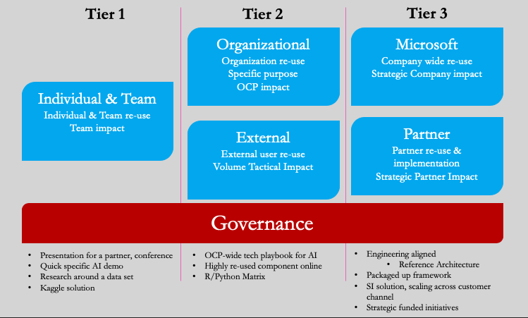

Code-with engagements should always strive to produce reusable technical assets. These assets will build velosity and reliability with other OCP managed partner projects. Throughout the lifecycle of the project, enginners should also determine if anything they are building would make a good reuasble, personal, tier 1 technical asset.  After completing a code-with project, time should be taken during the retrospective to identity ways to generalise the output from the engagment into a tier 2 or tier 3 tecnical asset.

## Technical Asset Tiers & Governance
OCP Technical Assets will be grouped into tiers to ensure that they are subject to the appropriate level of governance. The tiering and governance for these assets is defined as:

For any personal tier 1 assets produced from the engagement, you should follow the .

